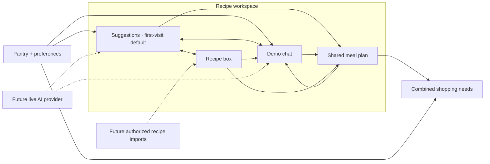

# Recipe workspace: delivery and development plan

## Product decision

Make `/meals` one recipe workspace with three connected views: **Suggestions** (the first-visit default), **Chat**, and **Plan**. A person can browse an idea, discuss it, save it to the recipe box, add it to the plan, and check the shopping list without copying a recipe or rebuilding context.

The agreed first release uses a clearly labeled demo assistant and an extensible server provider boundary. It is intended for the public demo at [lunchbox-snowy.vercel.app](https://lunchbox-snowy.vercel.app) after verification. Returning visitors resume their saved workspace view.

The attached workflow diagram describes the product vision. Its NYT/import, purchase-to-inventory, spot-planning, and broader meal-planning connections are future work; the drawing is not evidence that those integrations already exist.

Solid connections describe this release's user flow. Dotted connections describe planned extensions. Chat proposes recipes; a person's **Add to plan** action changes the plan. Planning does not change pantry quantities.

## Phase 1 — deliver the shared workspace

| Surface | Behavior | Shared handoff |
| --- | --- | --- |
| Suggestions | Match sample recipes to the pantry, serving preference, time limit, and use-soon preference | Save, discuss, or add the same recipe snapshot to the plan |
| Recipe box, inside Suggestions | Keep recipes to revisit; remove a saved recipe without removing planned meals | Uses the same recipe card and household actions as new suggestions |
| Chat | Offer bounded demo prompts for ideas, quicker options, use-soon ingredients, selected-recipe questions, and plan review | Recipe cards use the same save/add/discuss actions; unsupported requests explain the demo limits |
| Plan | Review selected recipes, change each meal's servings, remove a meal, find another recipe, or discuss the plan | One shared plan feeds the existing shopping calculation |
| Shopping | Show aggregate shortages after scaling planned servings and subtracting stock once | Pantry and plan remain the sources of truth |

Chat is a deterministic sample guide. It does not implement general natural-language reasoning, diet/allergy guarantees, substitutions, arbitrary serving instructions, recipe imports, or autonomous planning. Suggested prompts and the response source make that scope visible.

### Structures contributors can extend

- **Contracts:** `src/lib/contracts.ts` holds the only schemas for recipes, requests, responses, household state, saved recipes, and conversation messages. Request and response validation applies at the server boundary.
- **Provider boundary:** `src/features/meals/providers.ts` selects the demo implementation and validates its output. A future live adapter plugs into this boundary; it does not introduce a second set of UI contracts.
- **Existing suggestions API:** `POST /api/meals/suggest` remains `{ pantry, preferences }` → `{ source: 'demo' | 'ai', recipes }`.
- **Chat API:** `POST /api/meals/chat` accepts pantry, preferences, selected meals, recipe box, retained conversation, the new message, and an optional focused recipe with its serving context. It returns `{ source, reply, recipes, servings }`; response servings preserve the portions attached to each proposal. The initial demo recognizes supported commands; passing conversation context does not imply unrestricted conversational memory.
- **Reusable presentation:** `src/components/recipe-card.tsx` presents recipes across discovery surfaces; `meal-plan-panel.tsx` presents selected meal snapshots. Screens orchestrate these components and use the existing household provider.
- **Shared mutations:** `src/features/meals/workspace-state.ts` defines validated household actions. UI actions save/remove recipes, set recipe focus, retain chat, add/remove meals, or change planned servings. Provider responses do not mutate household state.
- **One persistence path:** the existing pantry storage adapter continues to save `lunchbox.household.v1`. An additive `workspace` default preserves earlier version-1 households and their pantry/plan. It retains the selected view, up to 100 saved recipes, the latest 20 chat messages, a draft of up to 1,000 characters, and a focused recipe. The existing limit of 50 planned meals remains.

Suggestions can be regenerated from the pantry. Saved recipes, conversation recipes, and planned meals retain independent validated snapshots, so changing one surface does not silently rewrite another. This release saves data in the current browser; it does not synchronize households across devices.

### Acceptance and release gate

1. A fresh household opens Suggestions. A saved household resumes its view without losing its pantry, preferences, or plan.
2. A suggestion can be saved, discussed with its recipe context, added from a chat card, edited in Plan, and reflected in Shopping. Switching views preserves the draft and conversation.
3. Saved recipes remain available after reload. Removing a saved recipe leaves existing planned snapshots intact; removing a planned meal leaves the recipe box and pantry intact.
4. Demo source labels remain visible. Unsupported requests do not claim to have applied constraints. Empty suggestions, an empty plan/recipe box, loading, request failure, and storage failure have understandable outcomes and a way to continue.
5. Canonical ingredient IDs and units drive matching. Scaled requirements combine before pantry stock is subtracted once. No implied conversions or inventory deductions appear in any view.
6. `npm run check` and `npm run build` pass. Verify the complete flow on desktop and mobile before merging the focused feature PR.
7. The integration lead releases through the existing `no-name-4c11/lunchbox` project and verifies the canonical production URL. Preview deployment protection stays enabled. Record actual verification/deployment evidence in the PR; this plan alone is not proof of release.

## Next development slices

| Slice | Deliverable | Ready when |
| --- | --- | --- |
| 2. Live AI | Server-only provider adapter for suggestions and chat; timeouts, validated output, request limits, and accurate source labels | The same workspace works with the adapter; malformed output, unavailable credentials, and provider errors recover without losing household state or silently presenting demo output as AI |
| 3. Recipe imports | Authorized URL/manual import boundary with attribution and a review step before saving | Imported ingredients map to canonical IDs and supported units, unresolved quantities are surfaced for correction, and a recipe cannot enter shopping calculations until its schema is valid |
| 4. Structured and spot planning | Optional date/meal slots and a quick “what can I make now?” entry point | Ad hoc selection and scheduled selection reuse recipe snapshots, serving controls, and the same shortage calculation; existing plans migrate safely |
| 5. Household sync | Replace/extend the storage adapter with authenticated household persistence and conflict handling | Membership, migration, sync failure, concurrent edits, and recovery have explicit behavior without adding a competing household provider |

For imports, NYT in the diagram is a candidate source, not a promised integration. Establish an authorized import mechanism and supported content terms first. Do not assume paywall access or retrieve restricted content. Provenance for imported recipes needs an integration-owned schema change; the current `demo | ai` source enum does not represent imports.

Purchases, cooking deductions, leftovers, and inventory replenishment are separate later workflows. Each needs explicit inventory transaction semantics and recovery behavior before connecting the diagram's grocery/inventory loops.

### Proposed live-AI action contract — future design

Keep ordinary answers and recipe proposals separate from household changes. If an AI later proposes “replace Tuesday dinner” or “add these three meals,” extend the response with a validated list of proposed actions rather than executing free-form text.

Each proposal should include an action ID, action kind, validated payload, short explanation, and the relevant household revision. Start with a small allowlist such as save recipe, add meal, remove meal, and set meal servings. The UI previews the exact change and requires the person to apply it. The client then runs the same household action path, rejecting stale revisions and duplicate action IDs. Provider text cannot directly issue pantry, purchase, or cooking mutations.

This proposal envelope is not part of the current chat API. Agree on it with the integration lead and planning owner before adding server tools or expanding shared contracts.

## Team ownership and integration

| Owner | Workspace responsibility | Coordination point |
| --- | --- | --- |
| 1. Integration lead | Shared schemas, API routes, configuration/dependencies, CI, PR integration, and deployment | Approves contract evolution and persistence migrations; owns the canonical Vercel project |
| 2. Pantry + storage | Pantry identity/units, storage adapter, backward compatibility, eventual sync | Coordinate workspace persistence fields with the integration lead and meal workflow owner |
| 3. AI workflow | Demo/live providers, request orchestration, conversation behavior, recipe normalization | Own feature logic in `src/features/meals/**`; coordinate the new chat route and all contract changes with integration |
| 4. Plan + shopping logic | Serving edits, aggregate shortages, later slots/spot planning, future action validation | Keep calculations in `src/features/planning/**`; coordinate new planning state with integration |
| 5. Frontend + demo experience | Workspace navigation, shared cards, conversation UI, plan screen, responsive/accessibility behavior | Keep screens in `src/components/**` and styles in `globals.css`; consume shared actions rather than duplicate feature logic |

Use focused branches and review cross-owner files explicitly in the PR. Preserve the original interactive concept and design portfolio as references. Read the installed Next.js guides before framework changes, as required by `AGENTS.md`.

## Verification matrix

| Area | Focused automated coverage | Browser check |
| --- | --- | --- |
| Persistence | Load old version-1 saves with workspace defaults; enforce collection/text limits; retain valid state on invalid edits | Reload a saved recipe, focused conversation, draft, selected view, and edited plan; exercise unavailable storage |
| Shared actions | Independent recipe snapshots; repeated save behavior; add/remove/serving changes leave pantry unchanged; retain latest 20 messages | Move from Suggestions → Discuss → Add to plan → Plan → Shopping; remove a saved recipe without affecting its planned copy |
| Providers/API | Valid/invalid requests and responses; bounded prompts; unsupported constraints; empty results; error responses | Loading and recoverable request error; demo labels; selected-recipe context; plan review after serving changes |
| Shopping | Serving scale, shared-ingredient aggregation, zero stock, positive shortages, mismatched units | Compare displayed shortages with the plan, then edit servings/remove a meal and verify recalculation |
| UI | Type/lint/build checks; focused behavior tests where domain rules change | Desktop/mobile layout, keyboard navigation, accessible controls/status, empty states, no lost draft on view changes |
| Release | Required checks on the final commit | Protected preview smoke check, then canonical public demo smoke check after production deployment |

The key risk is divergence between ways of choosing a recipe. Shared schemas, recipe presentation, household actions, and shopping calculations keep these paths consistent while allowing each teammate to improve one part independently.
